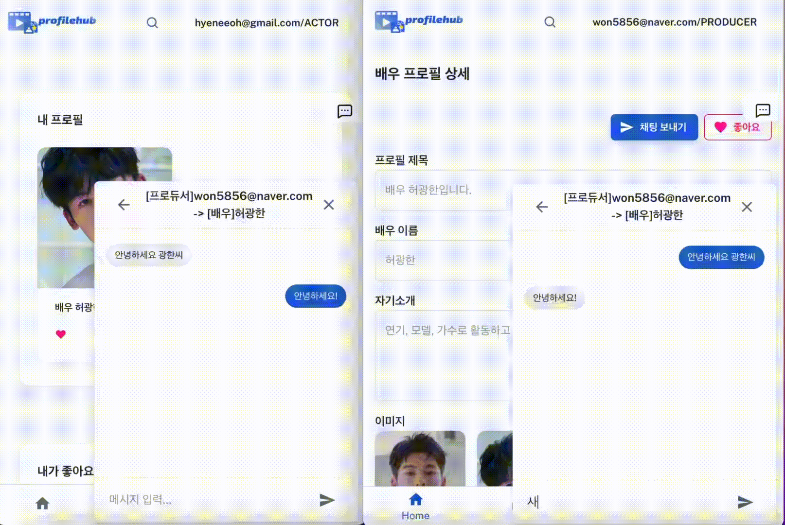
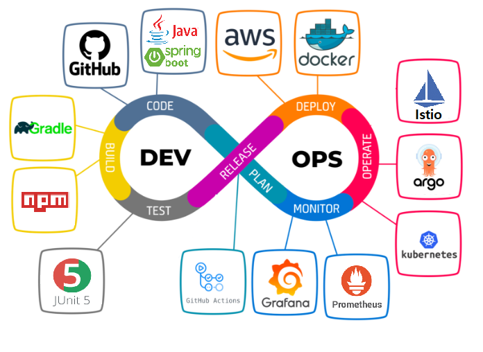
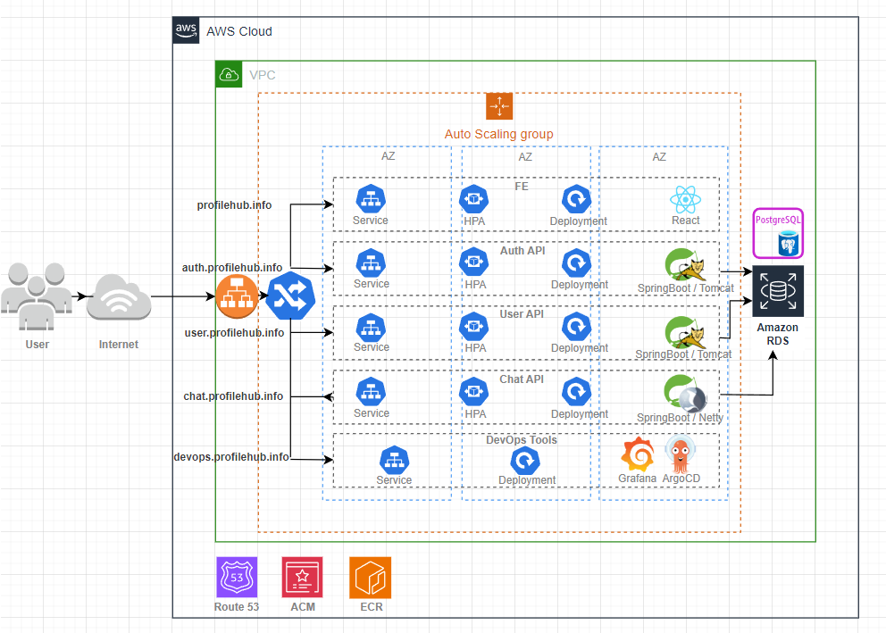
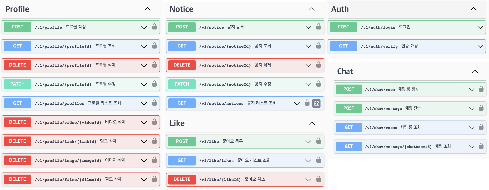
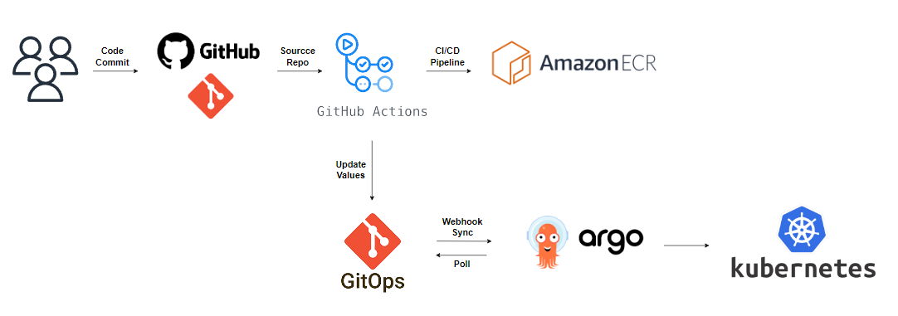

# profilehub

 

## 목차
- [프로젝트 소개](#project-introduction)
- [깃 레포지토리](#git-repo)
- [주요 기능](#main-function)
- [개발 환경 및 아키텍처](#development-environment)
- [BE API 명세](#swagger)
- [CI/CD 파이프라인](#cicd-pipeline)
- [모니터링](#monitoring)
  
 

## 프로젝트 소개
이 프로젝트는 '구름 KDT 쿠버네티스 전문가 양성 과정'의 파이널 프로젝트때 개발되었습니다. 이 프로젝트는 기존에는 오프라인으로 이뤄지던 배우(엑스트라)와 프로듀서 간의 구인/구직 과정에서 발생하는 효율성 문제를 해결하기 위한 목적으로 시작되었습니다.

과거에는 프로필 관리 및 채용 과정이 비효율적으로 이뤄져왔습니다. 이러한 문제점을 극복하고자, 우리는 효율적인 솔루션을 개발하기로 했습니다. 이 프로젝트는 프로필 관리, 채용 공고 게시 및 매칭 기능을 중심으로 하는 플랫폼을 개발하는 것이 목표입니다.

팀프로젝트는 7월까지 진행되었고, 이후 개인적으로 Auth API, Chat API, 좋아요 기능 추가 개발 및 React 화면 개발을 진행했습니다.

 

## 깃 레포지토리
| 레포지토리 | 역할 | 
|----------|----------|
| [profilehub-api-auth](https://github.com/hyewone/profilehub-api-auth) | BE) 인증, 인가, JWT 토큰 발행 |
| [profilehub-api-user](https://github.com/hyewone/profilehub-api-user) | BE) 프로필, 작품 공고, 좋아요, 지원 |
| [profilehub-api-chat](https://github.com/hyewone/profilehub-api-chat) | 채팅 |
| [profilehub-comm](https://github.com/hyewone/profilehub-comm) | BE) 공통 Entity, Repository, Util | 
| [profilehub-frontend](https://github.com/hyewone/profilehub-frontend) | FE) 화면 |
| [profilehub-gitops](https://github.com/hyewone/profilehub-gitops) | ArgoCD가 해당 레포와 Sync를 맞춰 클러스터에 배포 |
| [profilehub-terraform](https://github.com/hyewone/profilehub-terraform) | AWS 리소스 IaC 관리 |

 

## 주요 기능

| 배우 프로필 관리 | 작품 공고 관리 | 작품 지원하기 |
|----------|----------|----------|
| 작품 좋아요 | 마이 페이지 | 채팅 |

</img>
</img>
</img>
</img>

 

## 개발 환경 및 아키텍처
</img>

 

### API 개발 환경
| API | Dev Language | DevTools |
|----------|----------|----------|
| Auth API | JAVA | Tomcat, SpringSecurity, Spring WebMvc, JPA, Swagger, JWT, OAuth, PostgreSql |
| User API | JAVA | Tomcat, SpringSecurity, Spring WebMvc, JPA, Swagger, AWS SDK, PostgreSql |
| Chat API | JAVA | Netty, SpringSecurity, Spring WebFlux, JPA, Swagger, MongoDB   |
| Front | javascript | React, Redux |

 

### 전체 아키텍처

</img>
 

### 네트워크 아키텍처
</img>

 

## BE API 명세
</img>

 

## CI/CD 파이프라인
</img>

 

## Monitoring
</img>
