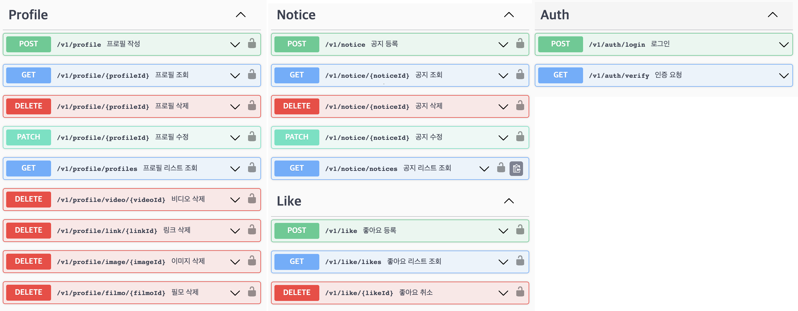
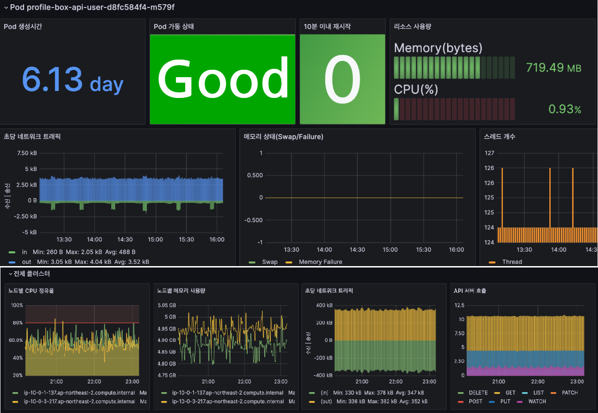

# profilehub

## 목차
- [프로젝트 소개](#)
  - ~ 이런거고 ~ 지속 개발하여 ~ 현재는 이렇습니다~
- [개발 환경](#)
  - 이런거 저런거 썼습니다~
- [아키텍처](#)
- [네트워크 아키텍처](#)
- [CI/CD 파이프라인](#)
  

## 프로젝트 소개

## 개발 환경

## 아키텍처

## 네트워크 아키텍처
</img>

## CI/CD 파이프라인
</img>

## BE API 명세
</img>

## Monitoring
</img>
